# Table des matieres :

## [Automatisation du Déploiement Active Directory](#automatisation-du-deploiement-active-directory)
- [1. Logique du script (Pseudo-code)](#logique-du-script)
- [2. Quelques points techniques.](#points-techniques)
  - [2.1. Normalisations des Données](#normalisations)
  - [2.2. Gestion Automatique des doublons](#gestion-automatique)
  - [2.3. Construction Dynamique des Groupes](#construction-dynamique)
- [3. Conclusion](#conclusion)

## [Configuration de la Gouvernance (GPO)](#configuration-gpo)
  - [4. Structure des Unités d'Organisation (OU)](#4-structure-des-ou)
  - [5. Stratégies de Sécurité (GPO de Restriction)](#5-strategies-securite)
    - [5.1. Politique de restriction des horaires d’accès)](#51restricted-logon-hours)
    - [5.2. Planifier une tâche pour la restriction des horaires](#task-scheduler)
  - [6. Stratégies de Configuration (GPO Standard)](#6-strategies-confort)
  - [7. Validation du Modèle de Tiering](#7-validation-tiering)

## [Mappage des lecteurs I, J, K](#mappage)
  - [8. Création des Partages et Sécurisation](#8-creation-des-partages)
  - [9. Configuration de la GPO de Mappage](#9-configuration-gpo)
  - [10. Détails des Lecteurs (I, J, K)](#10-details-lecteurs)
  - [11. Sécurisation et Isolation](#11-securisation)

## [Partage des rôles FSMO](#partage-des-rôles-fsmo)
 - [12. Partage FSMO](#12-partage-des-rôles-fsmo)

---


# Automatisation du Déploiement Active Directory
<span id="automatisation-du-deploiement-active-directory"></span>

Ce document détaille le fonctionnement du script Synchro-Ecotech.ps1.  
IL assure le déploiement automatisé de l'infrastructure (OUs), la création des comptes utilisateurs et la gestion des groupes de sécurité à partir d'un fichier source "Fiche_Personnel.csv"  
Il respecte la nomenclature établie dans le fichier [naming](/naming.md).

---

## 1. Logique du script (Pseudo-code) :
<span id="logique-du-script"><span/>

Le script suit une logique séquentielle :
    - Vérification des droits de l'utilsateur (Administrateur uniquement)
    - Lecture et compréhension du fichier "Fiche_personnel.csv"
    - Création du squelette du domaine
    - Synchronisation des utilisateurs et des groupes
    - Synchronisation des manageurs

``` markdown

## 1. INITIALISATION

    DÉBUT
        ### Note : La vérification des droits Admin est actuellement désactivée (commentée)
        
        ### CONFIGURATION

        MODE_SIMULATION = VRAI (Par défaut)
        DOMAINE = "ecotech.local"
        CHEMIN_LOG = "C:\Logs\EcoTech_Deploy_Date.log"
        FICHIER_CSV = ".\Fiche_personnels.csv"
        
        ### MAPPING (Départements RH -> Codes Dxx)

        CARTE_DEPT = {
            "Ressources Humaines" -> "D01",
            "Finance"             -> "D02",
            ... (jusqu'à D07)
        }
    FIN

## 2. FONCTION : Build-ServiceMap (Cartographie)

    ### Sert à générer dynamiquement les codes S01, S02...

    DÉBUT
        LIRE tout le CSV
        POUR CHAQUE Département :
            LISTER les Services uniques
            TRIER par ordre alphabétique
            ATTRIBUER un code incrémental (S01, S02, S03...)
            STOCKER la correspondance "Dxx-NomService" -> "Sxx"
        FIN POUR
    FIN

## 3. FONCTION : New-InfraStructure (Architecture)

    DÉBUT
        AFFICHER "Vérification Infrastructure..."
        
        ### Construction étage par étage (Si dossier inexistant -> Créer)

        1. RACINE "ECOTECH"
        2. SITE "BDX"
        3. TYPES "GX", "UX", "RX", "WX"
        
        ### Création des Départements

        POUR CHAQUE Conteneur ("UX", "RX")
            POUR CHAQUE CodeDept ("D01" à "D07")
                VERIFIER et CRÉER le dossier "Dxx" dans le Conteneur
            FIN POUR
        FIN POUR
    FIN


## 4. FONCTION : Sync-Users (Le Cœur du script)

    DÉBUT
        LIRE le CSV
        LANCER Build-ServiceMap (Pour préparer les codes Sxx)
        INITIALISER Compteurs (OK, KO, Skip)

        POUR CHAQUE Ligne du CSV :
            
            // A. CALCULS & NETTOYAGE
            PRÉNOM/NOM = Nettoyer (Espaces, Accents)
            ID_BASE    = 2 premières lettres Prénom + Nom
            CODE_DEPT  = Trouver Code Dxx via Carte_Dept

            // B. GESTION SERVICE & GROUPE (Si service renseigné)
            CODE_SVC = Trouver Code Sxx (ex: S01)
            SI Code_Svc existe :
                // 1. Création OU Service
                CHEMIN_CIBLE = "OU=[Sxx],OU=[Dxx],OU=UX..."
                SI OU "Sxx" manque : CRÉER OU (Description = Nom Réel Service)
                
                // 2. Création Groupe Service (Dans RX)
                NOM_GROUPE = "GRP-UX-[Dxx]-[Sxx]"
                SI Groupe manque : CRÉER Groupe de Sécurité
                AJOUTER Groupe à la liste "A Ajouter"

            // C. GESTION DOUBLONS (Homonymes)
            LOGIN_FINAL = ID_BASE
            COMPTEUR = 1
            TANT QUE (Compte AD [LOGIN_FINAL] existe déjà) :
                LOGIN_FINAL = ID_BASE + COMPTEUR
                INCREMENTER COMPTEUR
            FIN TANT QUE

            // D. CRÉATION UTILISATEUR
            SI Mode Simulation :
                JOURNALISER "Simulation création [LOGIN_FINAL]"
            SINON :
                ESSAYER :
                    CRÉER Utilisateur AVEC :
                        - SamAccountName = LOGIN_FINAL
                        - Tel Bureau     = Colonne "Telephone fixe"
                        - Chemin         = CHEMIN_CIBLE
                        - MotDePasse     = "EcoTech2026!" (Change à la connexion)
                    
                    AJOUTER Utilisateur au(x) Groupe(s) [NOM_GROUPE]
                    INCREMENTER Compteur OK
                SI ERREUR :
                    JOURNALISER l'erreur
                    INCREMENTER Compteur KO
            FIN SI
        FIN POUR
        
        AFFICHER Bilan (Succès / Erreurs)
    FIN

## 5. FONCTION : Sync-Managers (Hiérarchie)

    DÉBUT
        POUR CHAQUE Ligne du CSV :
            SI Colonne Manager remplie :
                RECHERCHER Compte de l'Employé (Via Login calculé)
                RECHERCHER Compte du Manager (Via Prénom + Nom)
                
                SI Les deux existent :
                    LIER l'objet Manager sur la fiche de l'Employé
                FIN SI
        FIN POUR
    FIN

## 6. MENU PRINCIPAL (Interface)

    BOUCLE INFINIE
        AFFICHER En-tête Graphique ("Synchro-Ecotech")
        AFFICHER État Mode Simulation (ACTIF / INACTIF)
        
        CHOIX UTILISATEUR :
            "s" -> Basculer Mode Simulation (Vrai/Faux)
            "1" -> Lancer New-InfraStructure
            "2" -> Lancer Sync-Users
            "3" -> Lancer Sync-Managers
            "4" -> Quitter
    FIN BOUCLE

```

---

## 2. Quelques points techniques.
<span id="points-techniques"><span/>

Le script intègre plusieurs mécanismes de sécurité et de standardisation pour gérer les cas limites (accents, doublons, structure dynamique).

---

### 2.1. Normalisations des Données
<span id="normalisations"><span/>

La fonction Get-CleanString est utilisée sur toutes les entrées textuelles avant d'interroger l'Active Directory.

``` PowerShell

# Fonction de nettoyage des chaînes de caractères
# Transforme "Hélène & François" en "helenefrancois"
$Text = $Text.ToLower().Normalize([System.Text.NormalizationForm]::FormD) -replace '\p{Mn}', ''
return $Text -replace '[^a-z0-9]', ''

``` 

L'Active Directory tolère mal les accents ou les caractères spéciaux.  
La normalisation des caractères permet que le domaine se retrouve avec la même écriture.  

---

### 2.2. Gestion Automatique des doublons :
<span id="gestion-automatique"><span/>

Pour éviter des erreurs de doublons qui pourraient bloquer le script, les homonymes sont gèrés automatiquement.

``` PowerShell

# Gestion automatique des homonymes
$SamAccountName = $IdBase
$Counter = 1

# Tant que le compte existe déjà dans l'AD, on incrémente (ex: tmartin1, tmartin2...)
while (Get-ADUser -Filter "SamAccountName -eq '$SamAccountName'" -ErrorAction SilentlyContinue) { 
    $SamAccountName = "$IdBase$Counter"
    $Counter++ 
}

```

---

Le script prend en compte les utilsateurs.  
Il les analyse, si l'ID est déjà pris.
Un suffixe numérique est rajouté.  
Exemple :  
- adabbassi devient adabbassi1 ou adabbassi2. (Le chiffre augmente jusqu'à trouver un ID libre).

---

### 2.3. Construction Dynamique des Groupes
<span id="construction-dynamique"><span/>

Le script applique la nomenclature définie dans le document [naming](/naming.md).

``` PowerShell

# Création dynamique du Groupe de Sécurité lié au Service
# Nomenclature : GRP-UX-[CodeDept]-[CodeService]
$GrpName = "GRP-UX-$DeptCode-$SCode"
# Le groupe est rangé dans l'OU de Ressources (RX) correspondante
$GrpPath = "OU=$DeptCode,OU=RX,OU=$SiteName,OU=$RootName,$DomainDN"

if (!(Get-ADGroup -Filter "Name -eq '$GrpName'")) {
     New-ADGroup -Name $GrpName -GroupScope Global -Path $GrpPath
}

```

Le script n'utilise pas de noms de groupes statiques. Il assemble dynamiquement le nom en combinant le code Département (Dxx) et le code Service (Sxx) généré lors de l'analyse du CSV. Le groupe est ensuite automatiquement rangé dans l'OU RX (Ressources), séparant proprement les utilisateurs des droits d'accès.

---

## 3. Conclusion
<span id="conclusion"><span/>

Le script permet de passer du "Fichier_Personnel.csv" à une infrastructure Active Directory complète et conforme.

---

# Configuration de la Gouvernance (GPO)
<span id="configuration-gpo"></span>

Cette section détaille la mise en œuvre des politiques de groupe nécessaires à la sécurisation et à l'administration de l'infrastructure `ecotech.local`.

---

### 4. Structure des Unités d'Organisation (OU)

<span id="4-structure-des-ou"></span>

L'arborescence Active Directory a été structurée sur 4 niveaux pour permettre une application précise des GPO et respecter le modèle de Tiering de l'ANSSI.

* **Niveau 3 (Obfuscation)** : Utilisation de codes neutres pour masquer la fonction des objets : **GX** (Admin), **UX** (Utilisateurs), **RX** (Groupes/Ressources) et **WX** (Postes de travail).
* **Niveau 4 (Départements)** : Segmentation sous **UX** et **RX** utilisant les codes **D01 à D07**.

---

### 5. Stratégies de Sécurité (GPO de Restriction)

<span id="5-strategies-securite"></span>

Conformément aux objectifs de sécurité, 7 GPO de restriction ont été identifiées, dont la gestion du pare-feu, le blocage du registre et la politique PowerShell.

#### Exemple détaillé : Politique de sécurité PowerShell

La GPO `CR-ADM-001-PowerShellSecurity-v1.0` assure que seuls les scripts autorisés s'exécutent sur les machines d'administration.

## **Étape 1** : Ouverture de la console **Group Policy Management**.

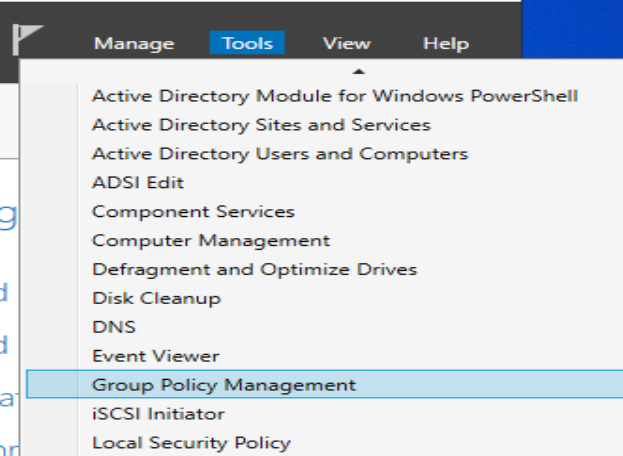

## **Étape 2** : Création

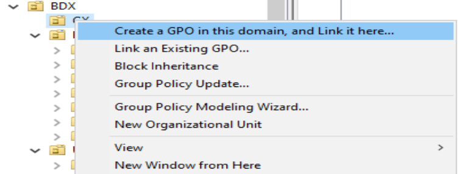

## **Étape 3** : Configuration

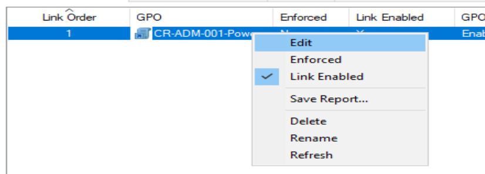
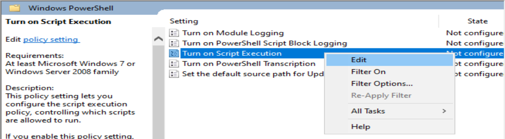
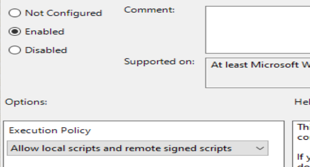

## **Étape 4** : Validation de la création et de la liaison sur l'OU **GX** (Tiering).

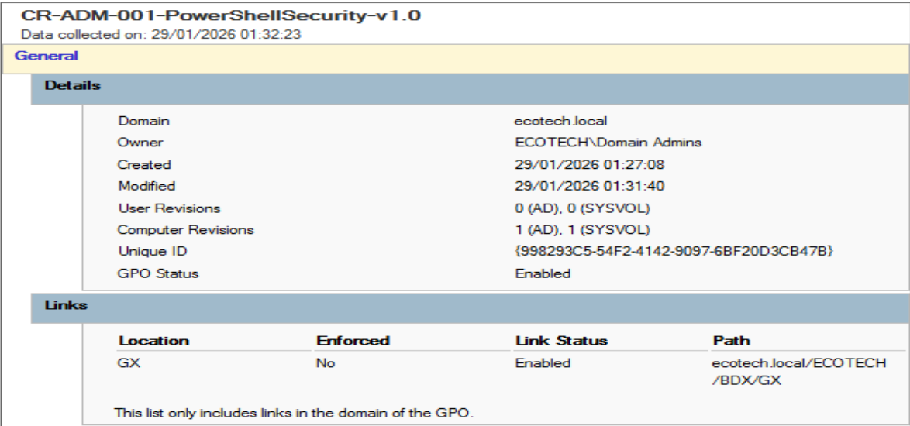

#### 5.1 Politique de restriction des horaires d’accès
<span id="51restricted-logon-hours"></span>

- **Objectif** : Restreindre les connexions des utilisateurs standard aux plages horaires autorisées, tout en permettant le bypass pour les administrateurs.
- **Règles** :
  - **Utilisateurs standard** :
    - Connexion autorisée du **lundi au vendredi**, de **7h à 20h**
    - Le **samedi** de **8h à 13h**
    - Dimanche : aucune connexion autorisée
  - **Administrateurs** : **bypass total**
  - **Groupe d’exception** : un groupe de sécurité dédié permet d’accorder le bypass à certains utilisateurs spécifiques sans leur donner de droits administratifs
- **Mise en œuvre technique** :
  
Script Powershell pour l'ajout de la restriction d'horaire à chaque utilisateur sauf les membres "Bypass"

``` Powershell

Import-module ActiveDirectory

# Horaires d'application Lundi au Vendredi => 7h-20h / Samedi => 8h-13h / Dimanche => bloqué

$logonHours = [byte[]]@(
    0,  0,  0,      # Dimanche
    192,255,7,      # Lundi   
    192,255,7,      # Mardi
    192,255,7,      # Mercredi
    192,255,7,      # Jeudi
    192,255,7,      # Vendredi
    128, 15, 0      # Samedi
)

# Exclusion des comptes

$exclus = @(
    (Get-ADGroupMember "CN=Grp_Admins_BilliU,OU=BILLIU,DC=ecotech,DC=local").distinguishedName
    (Get-ADGroupMember "CN=Grp_Bypass_Admin,OU=GX,OU=BDX,OU=ECOTECH,DC=ecotech,DC=local").distinguishedName
) | Sort-Object -Unique

# Application des restrictions (sauf comptes exclus)

$searchBase = "OU=UX,OU=BDX,OU=ECOTECH,DC=ecotech,DC=local"
Get-ADUser -Filter * -SearchBase $searchBase |
    Where-Object { $_.DistinguishedName -notin $exclus } |
    ForEach-Object {
        Write-Host "Mise à jour : $($_.SamAccountName)" -ForegroundColor Green
        Set-ADUser -Identity $_.DistinguishedName -Replace @{logonHours = $hoursLogon}
```

#### 5.2 Planifier une tâche pour la restriction des horaires
<span id="task-scheduler"></span>

- **Objectif**  
  Appliquer automatiquement les restrictions d’heures de connexion à tous les utilisateurs standards, tout en excluant les administrateurs et les membres du groupe de bypass.  
 
- **Choix technique**  
  Utilisation de **Windows Task Scheduler** (Planificateur de tâches) sur un contrôleur de domaine pour exécuter périodiquement le script PowerShell `RestrictedHours.ps1`.

- **Configuration de la tâche planifiée**

  **Nom de la tâche** : `Restricted_Hours`  
  **Compte d’exécution** : `ECOTECH\Administrator`  
  **Options de sécurité** :  
  - Run whether user is logged on or not  
  - Run with highest privileges  
  - Do not store password

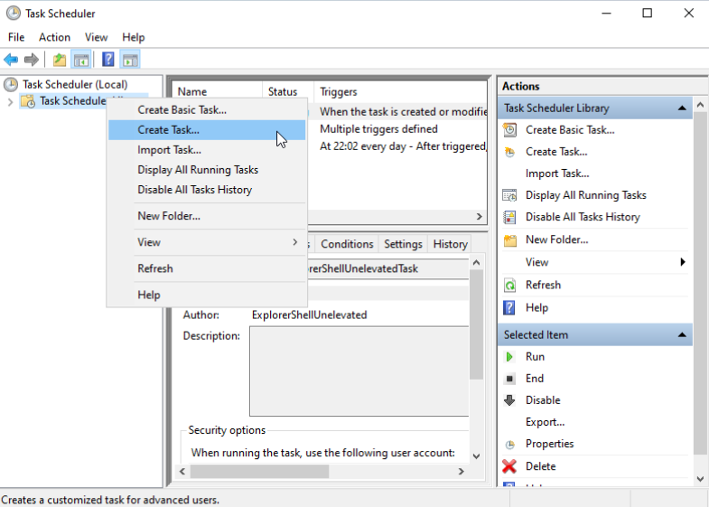

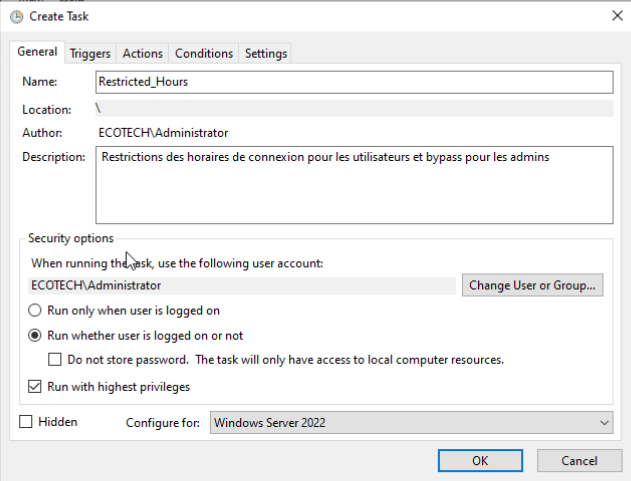

  **Déclencheur (Trigger)**  
  - Type : Weekly  
  - Jour : Lundi  
  - Heure de début : 06:50  
  - Récurrence : Toutes les semaines  
  - Date de début : 02/03/2026  
  - Synchronisé sur les fuseaux horaires

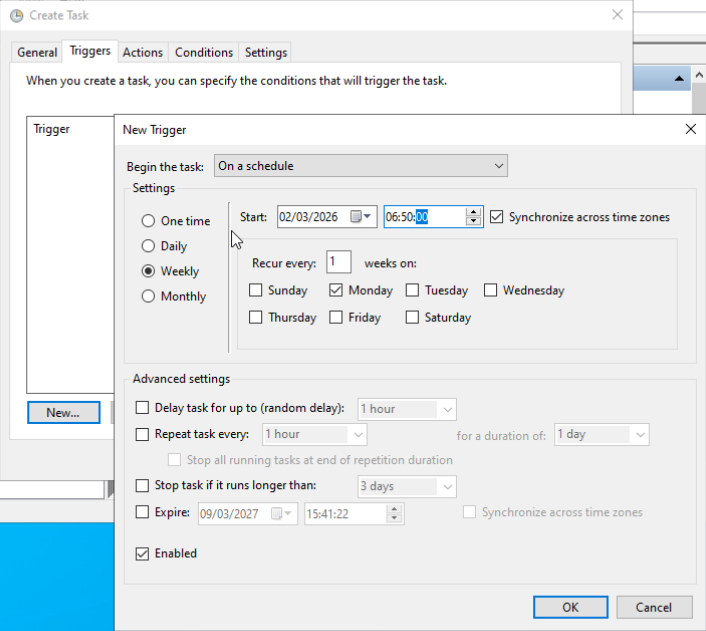

  **Action**  
  - Action : Start a program   
  - Programme/script : `C:\Scripts\RestrictedHours.ps1`  
   

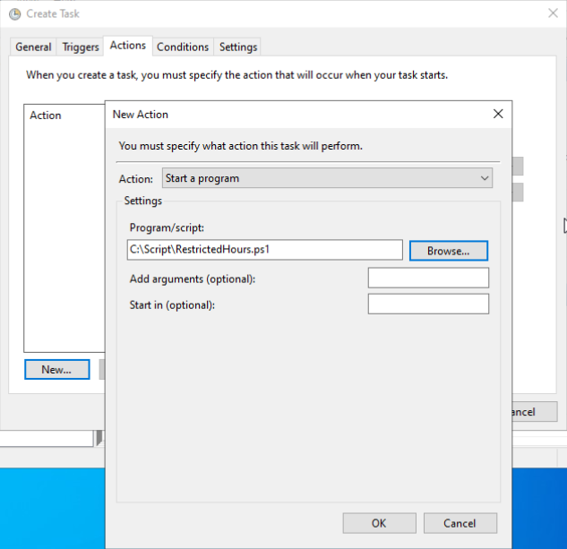

  **Conditions & Paramètres**  
  - Allow task to be run on demand : **Oui**  
  - If the task fails, restart every: 5 minutes → 3 fois  
  - Stop the task if it runs longer than: 1 hour  
  - If the running task does not end when requested, force it to stop  
  - If the task is already running: Do not start a new instance

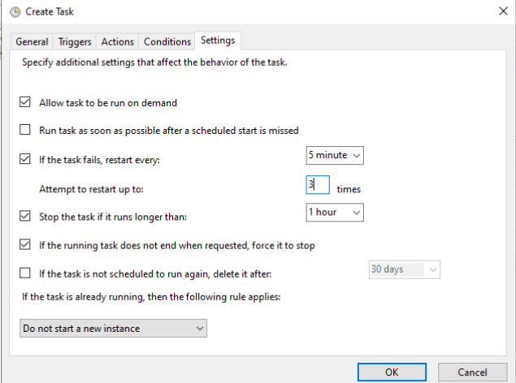

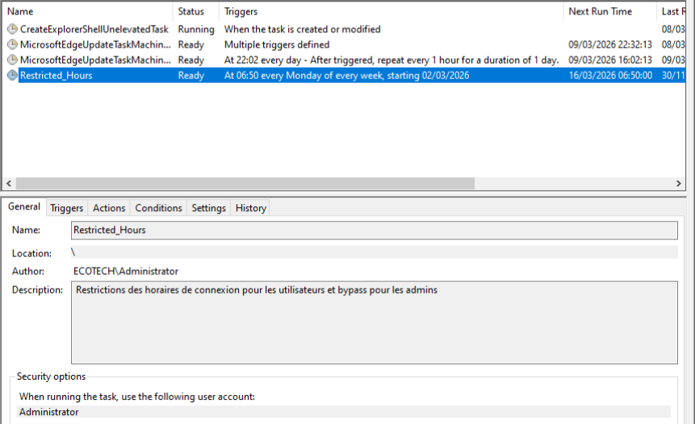


# Test sur un utilisateur

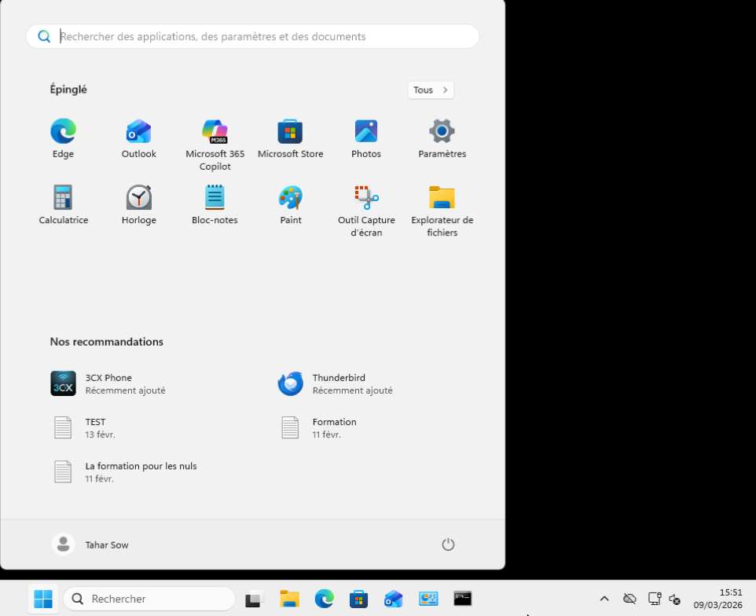


### 6. Stratégies de Configuration (GPO Standard)

<span id="6-strategies-confort"></span>

Exemple de GPO standards qui ont été déployées sur l'environnement de travail.

| Nom de la GPO                         | Cible       | Objectif                                                      |
| ------------------------------------- | ----------- | ------------------------------------------------------------- |
| **UP-BDX-010-DesktopWallpaper-v1.0**  | Utilisateur | Application du fond d'écran institutionnel.                   |
| **UP-BDX-022-DriveMapping-v1.1**      | Utilisateur | Mappage automatique des lecteurs réseaux départementaux.      |
| **UP-BDX-013-FolderRedirection-v1.0** | Utilisateur | Redirection des dossiers Bureau et Documents vers le serveur. |

---

### 7. Validation du Modèle de Tiering

<span id="7-validation-tiering"></span>

Le respect du modèle de Tiering est assuré par l'isolation de l'OU **GX**. La GPO `CR-ADM-005-RestrictedLogon-v1.0 interdit aux comptes d'administration (Tier 0/1) de se connecter sur des postes utilisateurs standards (OU **WX**) afin de prévenir le vol d'identifiants.

Toute modification de ces restrictions s'effectue par l'édition directe de l'objet lié :

Cette configuration garantit qu'une compromission sur un poste de travail `BX` ou `CX` ne pourra pas s'étendre aux comptes privilégiés du domaine.

---

## [Mappage des lecteurs I, J, K](#mappage)
<span id="mappage"></span>

## 8. Création des Partages et Sécurisation
<span id="8-creation-des-partages"></span>

Pour les lecteurs **I** **J** **K**, nous utilisons PowerShell pour créer une structure dont la visibilité est limitée par l'**Access-Based Enumeration (ABE)**.

### Étape 1 : Création du répertoire local

Nous créons les dossiers racine sur le serveur de fichiers.

```powershell
New-Item -Path "C:\Prive" -ItemType Directory
```
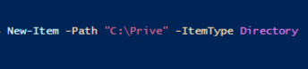

### Étape 2 : Partage avec énumération basée sur l'accès

Le paramètre `-FolderEnumerationMode AccessBased` garantit qu'un utilisateur ne verra que son propre dossier dans le partage.

```powershell
New-SmbShare -Name "Prive$" -Path "C:\Prive" -FullAccess "Administrators", "SYSTEM" -ReadAccess "Users" -FolderEnumerationMode AccessBased

```
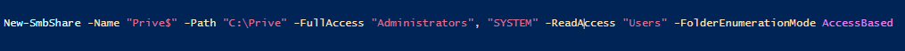

## 9. Configuration de la GPO de Mappage
<span id="9-configuration-gpo"></span>

Le mappage automatique est géré par la GPO.

### Emplacement de la stratégie

La configuration se situe dans : `Configuration utilisateur` > `Préférences` > `Paramètres Windows` > `Drive Maps`.

## 10. Détails des Lecteurs (I, J, K)
<span id="10-details-lecteurs"></span>

### Configuration du Lecteur K (Département)

Chaque lecteur utilise l'action **Update** pour assurer la persistance de la connexion.

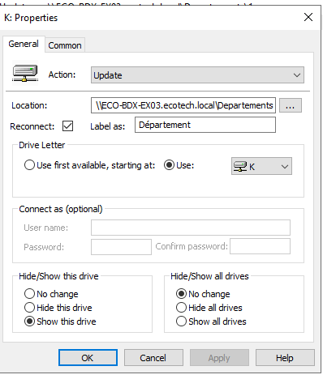

### Ciblage par Groupe (Item-Level Targeting)

Pour respecter la consigne "les autres utilisateurs ne voient pas ce dossier", chaque mappage est filtré par le groupe de sécurité AD correspondant.

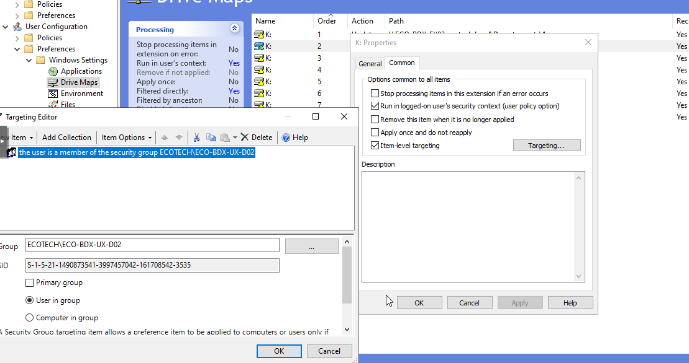

---

## 11. Sécurisation et Isolation
<span id="11-securisation"></span>

### Blocage de l'héritage

Pour les dossiers, l'héritage est désactivé au niveau de l'Unité d'Organisation (OU) ou du dossier pour isoler strictement les flux de données.

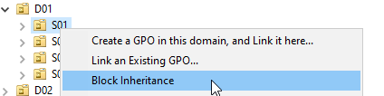

### Matrice de correspondance des lecteurs

| Lettre | Dossier | Accès | Visibilité |
| --- | --- | --- | --- |
| **I:** | **Privé** | Utilisateur uniquement | Masqué pour les autres (ABE) |
| **J:** | **Service** | Membres du Service (Sxx) | Masqué pour les autres services |
| **K:** | **Département** | Membres du Département (Dxx) | Masqué pour les autres départements |

---


## 12. Partage des rôles FSMO
---
### Configuration des rôles FSMO

Dans cette section, nous présentons la répartition des rôles FSMO au sein de notre infrastructure Active Directory, composée de trois contrôleurs de domaine : deux en mode Server Core et un en mode GUI. Ces cinq rôles — Schema Master, Domain Naming Master, RID Master, PDC Emulator et Infrastructure Master — ont été répartis de manière stratégique entre nos DC afin d'assurer une gestion optimale du domaine, une meilleure tolérance aux pannes et un équilibrage cohérent des responsabilités.

### A] Configuration du deuxième DC
---
Afin de répartir les rôles FSMO de manière optimale, vous avez configuré le deuxième contrôleur de domaine (ECO-BDX-EX02) via l’interface graphique. Voici les étapes réalisées dans l’ordre chronologique :

1. **Ouverture de la console de gestion**  
   Vous avez lancé la console **Active Directory Users and Computers**.  
   Vous avez ensuite développé le domaine ecotech.local afin d’accéder aux options de gestion.


2. **Accès à la fenêtre Operations Masters**  
   Vous avez fait un clic droit sur le domaine ecotech.local, puis sélectionné **Operations Masters** dans le menu contextuel.


3. **Transfert du rôle PDC Emulator**  
   Dans l’onglet **PDC**, le rôle était initialement détenu par ECO-BDX-EX01.ecotech.local.  
   Vous avez cliqué sur le bouton **Change…**, sélectionné le serveur ECO-BDX-EX02.ecotech.local et confirmé le transfert.  
   La fenêtre a ensuite affiché le rôle **PDC Emulator** comme actif sur ECO-BDX-EX02.


4. **Vérification et transfert du rôle RID Master**  
   Vous avez basculé sur l’onglet **RID**.  
   Vous avez transféré le rôle **RID Master** vers ECO-BDX-EX02.ecotech.local en utilisant le même bouton **Change…**.


5. **Validation de la nouvelle répartition**  
   Vous avez ouvert une console Windows PowerShell en tant qu’administrateur et exécuté la commande suivante :  
   
       netdom query fsmo


### B] Configuration du troisième DC
---
*Afin de compléter l’infrastructure Active Directory avec un troisième contrôleur de domaine, vous avez procédé à la promotion du serveur en contrôleur de domaine additionnel dans le domaine existant ecotech.local.*

#### Voici les étapes réalisées dans l’ordre chronologique :

##### 1. **Installation de la fonctionnalité Active Directory Domain Services**  
   
Vous avez tout d’abord vérifié la disponibilité de la fonctionnalité à l’aide de la commande :  

       Get-WindowsFeature AD-Domain-Services

   Puis vous l’avez installée avec les outils de gestion grâce à la commande :

       Install-WindowsFeature AD-Domain-Services -IncludeManagementTools


   L’installation s’est terminée avec succès.


##### 2. **Lancement de la promotion en contrôleur de domaine**
Vous avez exécuté la commande suivante pour promouvoir le serveur :
        
        Install-ADDSDomainController -DomainName "ecotech.local" -Credential (Get-Credential)

*La fenêtre « Windows PowerShell credential request » est apparue. Vous avez saisi les identifiants du compte Administrator du domaine ecotech.local.*


- Définition du mot de passe SafeModeAdministratorPassword
- Vous avez saisi puis confirmé le mot de passe SafeModeAdministratorPassword qui sera utilisé en cas de restauration du contrôleur de domaine.
- Confirmation de l’opération
- Le système vous a demandé de confirmer le lancement de l’opération. Vous avez répondu Y pour poursuivre.


- Exécution de l’installation
- Le processus Install-ADDSDomainController s’est lancé. Il a effectué avec succès :
- La détermination de la source de réplication DC
- La validation de l’environnement et des entrées utilisateur
- Tous les tests ont été complétés avec succès
- L’installation du nouveau contrôleur de domaine et la configuration des services Active Directory Domain Services ont alors commencé.
- Les deux avertissements standards (compatibilité des algorithmes de chiffrement avec Windows NT 4.0 et délégation DNS) sont apparus ; ils sont attendus et n’ont pas impacté le déroulement de l’opération.


### Répartition finale des rôles FSMO sur le troisième DC

Transfert du rôle Infrastructure Master
La commande suivante a été exécutée pour déplacer le rôle vers le nouveau contrôleur de domaine :

    Move-ADDirectoryServerOperationMasterRole -Identity "ECO-BDX-EX17" -OperationMasterRole InfrastructureMaster


Vérification de la nouvelle répartition des rôles FSMO

La commande suivante a été lancée pour confirmer la localisation actuelle de tous les rôles :

    netdom query fsmoLe résultat affiche la répartition finale :


##### **Résumé**

| Serveur | Rôle FSMO |
|---|---|
| ECO-BDX-EX01.ecotech.local | Schema Master |
| ECO-BDX-EX01.ecotech.local | Domain Naming Master |
| ECO-BDX-EX02.ecotech.local | PDC Emulator |
| ECO-BDX-EX02.ecotech.local | RID Pool Manager |
| ECO-BDX-EX17.ecotech.local | Infrastructure Master |


###### Cette configuration finale répartit les cinq rôles FSMO de manière équilibrée entre les trois contrôleurs de domaine :

- ECO-BDX-EX01 héberge les rôles globaux du domaine et de la forêt (Schema Master et Domain Naming Master),
- ECO-BDX-EX02 gère les rôles liés aux opérations quotidiennes du domaine (PDC Emulator et RID Master),
- ECO-BDX-EX17 prend en charge le rôle Infrastructure Master, souvent recommandé sur un DC qui n’est pas Global Catalog si des environnements multi-domaines existent (ici, domaine unique, donc placement flexible).

**Cette répartition assure une haute disponibilité, un équilibrage de charge et une meilleure tolérance aux pannes au sein de l’infrastructure Active Directory ecotech.local.**


Cette troisième promotion a permis d’obtenir une infrastructure Active Directory composée de trois contrôleurs de domaine, offrant une meilleure tolérance aux pannes et une répartition équilibrée des rôles FSMO.
