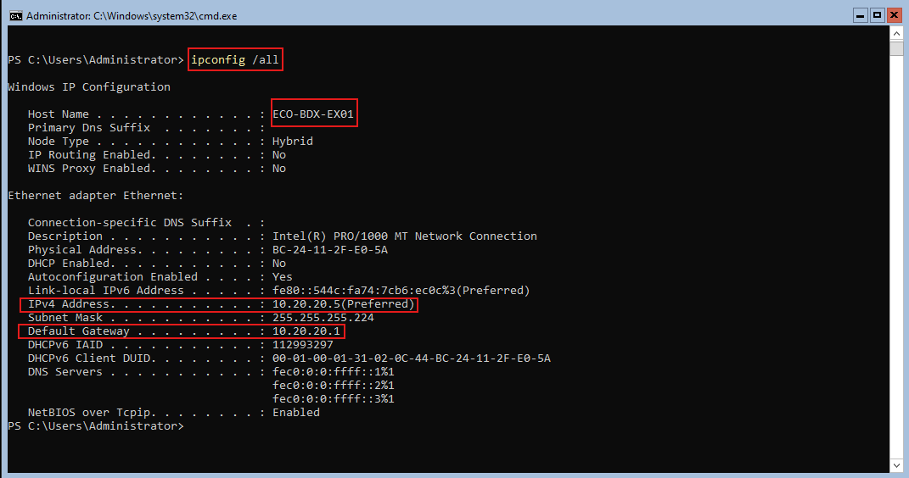
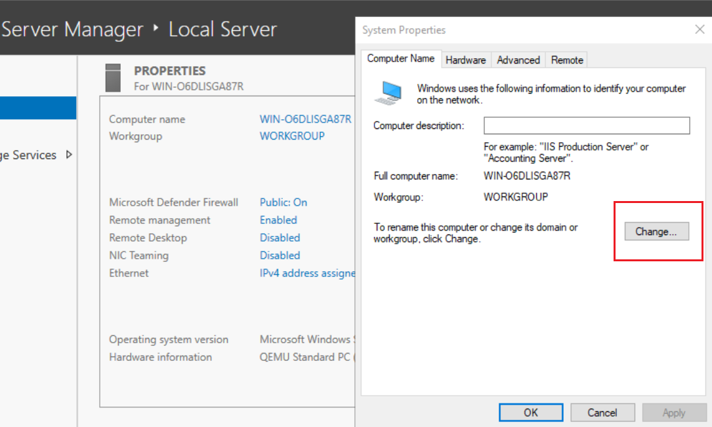
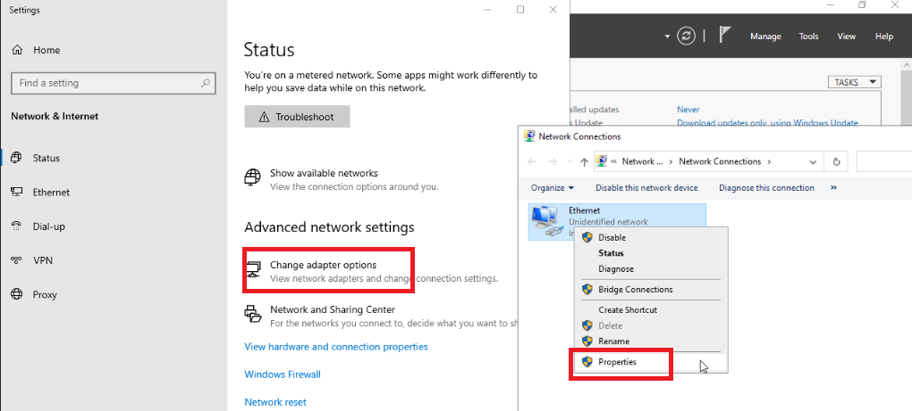
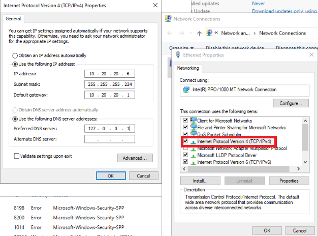
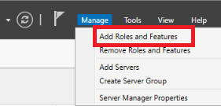
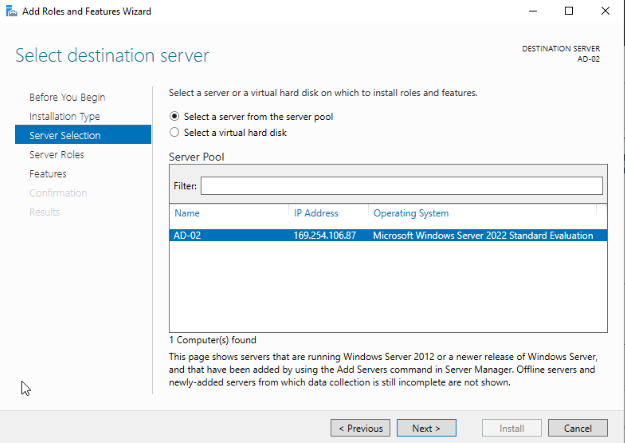
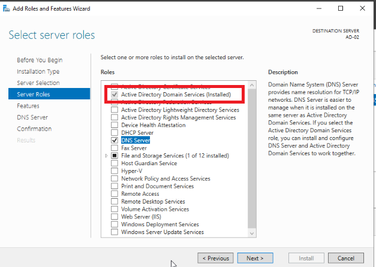
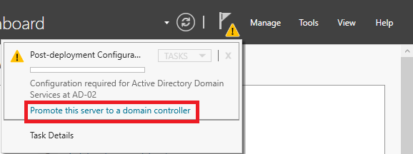
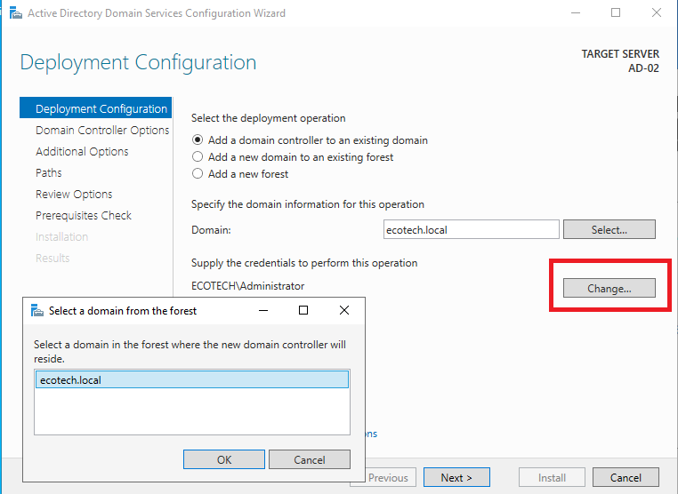

<span id="haut-de-page"></span>
# Table des matières :
## [Déploiement du Contrôleur de Domaine Principal Version Core](#déploiement-du-contrôleur-de-domaine-principal)
  - [1. Configuration de l'Hôte](#1-configuration-de-lhôte)
    - [1.1. Nom d'hôte](#11-nom-dhôte-)
    - [1.2. Adressage IPv4 statique :](#12-adressage-ipv4-statique-)
  - [2. Installation et Promotion Active Directory](#2-installation-et-promotion-active-directory)
    - [2.1. Préparation du rôle](#21-préparation-du-rôle)
    - [2.2. DNS Local](#22-dns-local-)
    - [2.3. Promotion de la Forêt](#23-promotion-de-la-forêt)
  - [3. Conclusion du déploiement](#3-conclusion-du-déploiement)

##  [Déploiement du Contrôleur de Domaine Secondaire Version GUI](#déploiement-du-contrôleur-de-domaine-secondaire)
  - [4. Configuration de l'Hôte](#4-configuration-de-lhôte)
    - [4.1. Nom d'hôte](#41-nom-dhôte-)
    - [4.2. Adressage IPv4 statique DNS](#42-adressage-ipv4-statique-et-dns)
 - [5. Installation Active Directory Domain Service Avec Ajout à un Domaine](#5-installation-active-directory-domain-service-avec-ajout-a-un-domaine)
    - [5.1. Ajout à la Forêt](#51-ajout-a-la-foret)
  - [6. Conclusion du déploiement](#6-conclusion-du-déploiement)


# Déploiement du Contrôleur de Domaine Principal
<span id="deploiment-controleur"><span/>

Ce document retrace les étapes techniques du déploiement du serveur ECO-BDX-EX01, premier contrôleur de domaine de l'infrastructure EcoTech Solutions.  
Les captures d'écran présentes dans le document permettent d'améliorer la compréhension de l'installation du serveur.

---

## 1. Configuration de l'Hôte
<span id="configuration"><span/>

Avant la promotion AD, les paramètres suivants ont été validés pour garantir la conformité au document **[naming.md](/naming.md)**

---

### 1.1. Nom d'hôte : 
<span id="nom"><span/>

* `ECO-BDX-EX01` (Conforme au standard ECO-CodeSite-CodeTypeNum).  
Une fois la commande pour accéder au changement de nom rentrée, il suffit d'écrire le nouveau nom et de valider.  
La machine va redémarrer et le nouveau nom va s'appliquer.

---

### 1.2. Adressage IPv4 statique : 
<span id="adressage-ipv4"><span/>

* `10.20.20.5` (Masque /27), Passerelle par défaut `10.20.20.1`.

Pour la configuration IP du serveur, il est préférable de passer par des commandes PowerShell.
* Premièrement, trouver l'interface IP avec la commande `Get-NetIPInterface -AddressFamily IPv4`.
* Deuxièmement, configurer l'adresse IP sur la bonne interface trouvée précédemment avec la commande  
`New-NetIPAddress -InterfaceIndex 3 -IPAddress 10.20.20.5 -PrefixLength 27 -DefaultGateway 10.20.20.1`.
* Troisièmement, vérifier via la commande `ipconfig /all` si la configuration s'est bien appliquée.


   
---

## 2. Installation et Promotion Active Directory
<span id="installatio-promotion"><span/>

La phase de promotion est le moment où le serveur "EX01" passe du statut de simple serveur membre à celui de Contrôleur de Domaine (DC).  
Pour faciliter le déploiement, il est préférable de passer par des commandes PowerShell.

### 2.1. Préparation du rôle
<span id="prepartaion"><span/>

- Exécuter la commande `Install-WindowsFeature -Name AD-Domain-Services -IncludeManagementTools`

Cette commande permet au serveur de récupérer tous les éléments nécessaires pour la future promotion.

---

### 2.2. DNS Local : 
<span id="dns"><span/>

Les explications de l'installation se font sur le fichier [Installation du serveur DNS sur le Contrôleur de Domaine Principal Version Core](/components/dns/installation.md)

---

### 2.3. Promotion de la Forêt
<span id="promotion-foret"><span/>

Le paramétrage suivant a été appliqué pour créer la forêt racine ecotech.local :

``` PowerShell

$ForestConfiguration = @{
    'DatabasePath'           = 'C:\Windows\NTDS';
    'DomainMode'             = 'WinThreshold';
    'DomainName'             = 'ecotech.local';
    'DomainNetbiosName'      = 'ECOTECH';
    'ForestMode'             = 'WinThreshold';
    'InstallDNS'             = $true;
    'LogPath'                = 'C:\Windows\NTDS';
    'NoRebootOnCompletion'   = $false;
    'SysvolPath'             = 'C:\Windows\SYSVOL';
    'Force'                  = $true;
    'CreateDnsDelegation'    = $false
}

Import-Module ADDSDeployment
Install-ADDSForest @ForestConfiguration

```

Quelques explications :  
* `'DomainMode' et 'ForestMode' = 'WinThreshold'` :  
  * Ce paramètre définit le niveau fonctionnel, ici Windows Server 2016  
  * Il active les dernières fonctionnalités de sécurité et assure la compatibilité avec d'éventuels DC secondaires sous Windows 2016/2019  
* `'InstallDNS' = $true` :  
  * L'Active Directory ne peut pas fonctionner sans DNS. En couplant l'installation, on crée une zone DNS intégrée à l'AD.  
  * `'CreateDnsDelegation' = $false` :  
* On met ce paramètre à `false` car `ecotech.local` est une nouvelle forêt racine.

---

## 3. Conclusion du déploiement
<span id="conclusion"><span/>

Suite à la validation de ces paramètres, le serveur est promu en Contrôleur de Domaine (AD-DC). Le serveur redémarre automatiquement pour finaliser l'installation des services d'annuaire et appliquer les nouvelles politiques de sécurité.  

Changements post-redémarrage :
* Authentification : La connexion se fait désormais via le compte domaine ECOTECH\Administrator.  
* DNS : Le serveur devient l'autorité DNS primaire pour la zone ecotech.local.
* Gestion : Le module PowerShell ActiveDirectory est désormais opérationnel pour la création des unités d'organisation (OU) conformément au plan de Tiering.  


# Déploiement du Contrôleur de Domaine Secondaire
<span id="déploiement-du-contrôleur-de-domaine-secondaire"><span/>

Ce document retrace les étapes techniques du déploiement du serveur ECO-BDX-EX02, second contrôleur de domaine de l'infrastructure EcoTech Solutions.  
Les captures d'écran présentes dans le document permettent d'améliorer la compréhension de l'installation du serveur.

---

## 4. Configuration de l'Hôte
<span id="configuration"><span/>

Avant la promotion AD, les paramètres suivants ont été validés pour garantir la conformité au document **[naming.md](/naming.md)**

---

### 4.1. Nom d'hôte : 
<span id="nom"><span/>

* `ECO-BDX-EX02` (Conforme au standard ECO-CodeSite-CodeTypeNum).  
Une fois la commande pour accéder au changement de nom rentrée, il suffit d'écrire le nouveau nom et de valider.  
La machine va redémarrer et le nouveau nom va s'appliquer.



### 4.2. Adressage IPv4 statique et DNS : 
<span id="42-adressage-ipv4-statique-et-dns"></span>

* `10.20.20.6` (Masque /27), Passerelle par défaut `10.20.20.1`.

Mise en place de l'IP statique dans les paramètres de connexion





---

## 5. Installation Active Directory Domain Service Avec Ajout à un Domaine
<span id="5-installation-active-directory-domain-service-avec-ajout-a-un-domaine"></span>

Etape d'installation de ADDS suivi de l'ajout au domaine ecotech.local



Ensuite "Next" jusqu'à la sélection du server



Selectionner le rôle souhaité, ici ADDS



Et enfin, lancer l'installation et fermer la fenêtre, l'installation se fera en arrière plan.


### 5.1. Ajout à la Forêt
<span id="51-ajout-a-la-foret"></span>

Le paramétrage suivant a été appliqué pour ajouter ECO_BDX_EX02 à la forêt racine ecotech.local :

Pour commencer cliquer sur le drapeau avec le triangle jaune qui s'affiche une fois l'installation de ADDS terminé.



Ensuite entrer le nom du domaine et entrer les informations demandées après avoir cliqué sur "change"



Pour finir suivre les instructions jusqu'à l'ajout au domaine.

## 6. Conclusion du déploiement
<span id="conclusion"><span/>

A la fin de ces procédures ECO_BDX_EX02 a bien été ajouté au domaine ecotech.local

Changements post-redémarrage :
* Authentification : La connexion se fait désormais via le compte domaine ECOTECH\Administrator.  
* DNS : Le serveur devient l'autorité DNS primaire pour la zone ecotech.local.
* Gestion : Le module PowerShell ActiveDirectory est désormais opérationnel pour la création des unités d'organisation (OU) conformément au plan de Tiering.

<p align="right">
  <a href="#haut-de-page">⬆️ Retour au début de la page ⬆️</a>
</p>
