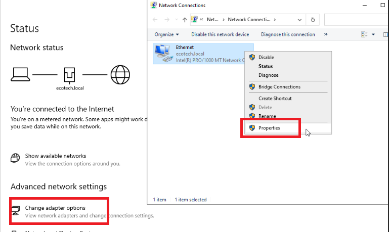
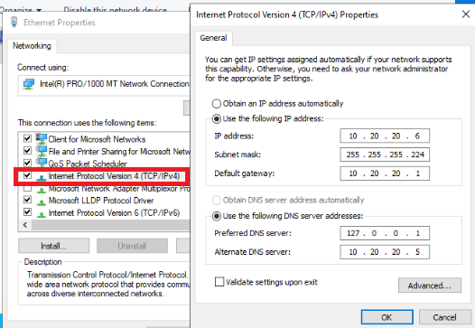

# Configuration du serveur DNS sur le Contrôleur de Domaine Principal Version Core.

## Table des matieres :

- [1. Configuration des Forwarders](#configuration-forwarders)
- [2. Sécurisation](#securisation)

## 1. Configuration des Forwarders.
<span id="configuration-forwarders"><span/>

Pour permettre aux utilisateurs et aux serveurs d'accéder à Internet (mises à jour, navigation via proxy), le serveur doit rediriger les requêtes qu'il ne connaît pas vers l'extérieur.

- Cible Primaire : 10.40.0.1 (Interface du pfSense).
- Cible Secondaire : 8.8.8.8 (Google DNS).

``` PowerShell
Add-DnsServerForwarder -IPAddress "10.40.0.1", "8.8.8.8"
```

## 2. Sécurisation
<span id="securisation"><span/>

Conformément au standard de Tiering, les transferts de zone sont restreints pour éviter la fuite d'informations.  
Le serveur autorise uniquement le contrôleur secondaire à répliquer l'annuaire.

``` PowerShell
Set-DnsServerPrimaryZone -Name "ecotech.local" -SecureSecondaries "TransferToSecureServers" -SecondaryServers "10.20.20.6"
```

# Configuration du serveur DNS sur le Contrôleur de Domaine Secondaire Version GUI.
<span id="domaine-secondaire"><span/>

Pour la version GUI la configuration se passe dans les paramètres réseaux.




**Serveur DNS préféré** : `127.0.0.1`
**Serveur DNS alternatif** : `10.20.20.5`
