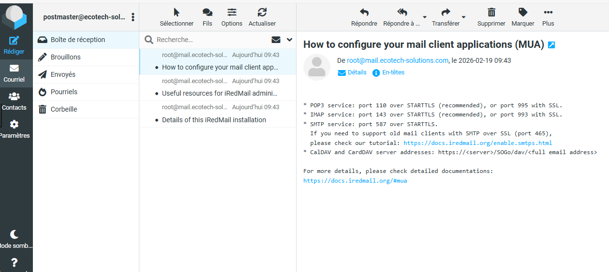
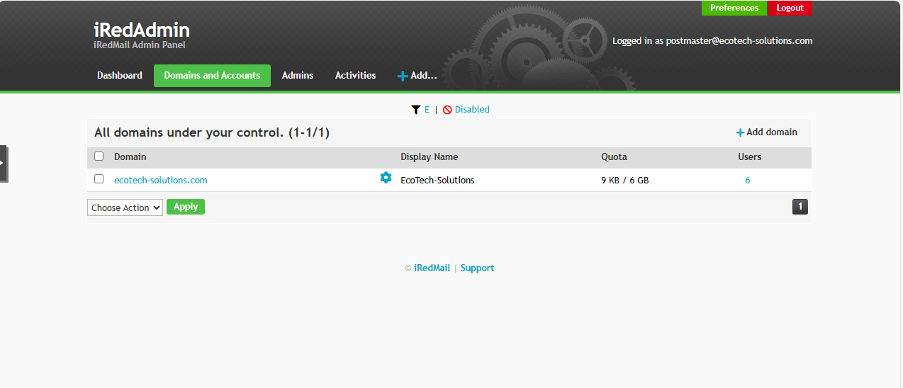

<span id="haut-de-page"></span>

# Configuration iRedMail

Ce document décrit les étapes essentielles après l'installation et le redémarrage d'un serveur **iRedMail open source** sur Debian.

## Table des matières

## [Vérifications et accès de base](#vérifications-et-accès-de-base)
  - [1. Vérifications de base](#1-vérifications-de-base)
    - [1.1. Vérification des services et ports](#11-vérification-des-services-et-ports)
    - [1.2. Fichier iRedMail.tips](#12-fichier-iredmailtips)
  - [2. Accès aux interfaces web](#2-accès-aux-interfaces-web)
    - [2.1. Webmail Roundcube](#21-webmail-roundcube)
    - [2.2. Interface admin iRedAdmin](#22-interface-admin-iredadmin)
    - [2.3. Monitoring Netdata](#23-monitoring-netdata)

## [Gestion des utilisateurs et administrateurs](#gestion-des-utilisateurs-et-administrateurs)
  - [3. Connexion administrateur global initial](#3-connexion-administrateur-global-initial)
  - [4. Gestion des domaines](#4-gestion-des-domaines)
    - [4.1. Ajouter un nouveau domaine](#41-ajouter-un-nouveau-domaine)
  - [5. Création et gestion des utilisateurs](#5-création-et-gestion-des-utilisateurs)
    - [5.1. Créer un nouvel utilisateur / boîte mail](#51-créer-un-nouvel-utilisateur--boîte-mail)
    - [5.2. Changer un mot de passe utilisateur](#52-changer-un-mot-de-passe-utilisateur)
  - [6. Différence Global Admin vs Domain Admin](#6-différence-global-admin-vs-domain-admin)
  - [7. Bonnes pratiques et résumé des accès](#7-bonnes-pratiques-et-résumé-des-accès)
    - [7.1. Bonnes pratiques rapides](#71-bonnes-pratiques-rapides)
    - [7.2. Résumé des accès](#72-résumé-des-accès)
  - [8. Configuration du client Thunderbird](#8-configuration-du-client-thunderbird)
    - [8.1. Paramètres de connexion recommandés](#81-paramètres-de-connexion-recommandés)
    - [8.2. Étapes de configuration](#82-étapes-de-configuration)
    - [8.3. Gestion des certificats (Exception de sécurité)](#83-gestion-des-certificats-exception-de-sécurité)
  - [9. Synchronisation et Connexion LDAP](#9-synchronisation-et-connexion-ldap)
    - [9.1. Pourquoi utiliser LDAP ?](#91-pourquoi-utiliser-ldap)
    - [9.2. Paramètres de liaison (Bind)](#92-paramètres-de-liaison-bind)
    - [9.3. Test de connectivité en ligne de commande](#93-test-de-connectivité-en-ligne-de-commande)
---

## <span id="vérifications-et-accès-de-base"></span>Vérifications et accès de base

### <span id="1-vérifications-de-base"></span>1. Vérifications de base

#### <span id="11-vérification-des-services-et-ports"></span>1.1. Vérification des services et ports

Connectez-vous en root et exécutez :

```bash
# État des services principaux
systemctl status postfix dovecot nginx mariadb fail2ban

# Ports en écoute (25, 465, 993, 143, 80, 443)
ss -ltn | grep -E ':25|:465|:993|:143|:80|:443'
```

#### <span id="12-fichier-iredmailtips"></span>1.2. Fichier iRedMail.tips

Ce fichier contient toutes les informations critiques (URLs, mots de passe, etc.) :

```bash
# Afficher le fichier (adaptez le chemin si nécessaire)
cat /root/iRedMail-1.7.4/iRedMail.tips
```

**Important :** Copiez ce fichier en lieu sûr **immédiatement** (clé USB chiffrée, gestionnaire de mots de passe, etc.). Ne le laissez pas sur le serveur exposé.

### <span id="2-accès-aux-interfaces-web"></span>2. Accès aux interfaces web

Testez ces adresses dans un navigateur (remplacez `10.50.0.7` par votre IP publique ou FQDN) :

#### <span id="21-webmail-roundcube"></span>2.1. Webmail Roundcube
"https://10.50.0.7/mail/" ou "https://mail.ecotech-solutions.com/mail/"

Identifiant : `postmaster@ecotech-solutions.com`



#### <span id="22-interface-admin-iredadmin"></span>2.2. Interface admin iRedAdmin
"https://10.50.0.7/iredadmin/" ou "https://mail.ecotech-solutions.com/iredadmin/"

Identifiant : `postmaster@ecotech-solutions.com`



#### <span id="23-monitoring-netdata"></span>2.3. Monitoring Netdata
"https://10.50.0.7/netdata/" ou "https://mail.ecotech-solutions.com/netdata/"

Identifiant : `postmaster@ecotech-solutions.com`

## <span id="gestion-des-utilisateurs-et-administrateurs"></span>Gestion des utilisateurs et administrateurs

### <span id="3-connexion-administrateur-global-initial"></span>3. Connexion administrateur global initial

- **URL** : https://10.50.0.7/iredadmin/
- **Identifiant** : `postmaster@ecotech-solutions.com` (ou le domaine choisi à l’installation)
- **Mot de passe** : celui défini pendant l’installation (voir `iRedMail.tips`)

### <span id="4-gestion-des-domaines"></span>4. Gestion des domaines

#### <span id="41-ajouter-un-nouveau-domaine"></span>4.1. Ajouter un nouveau domaine

1. Connectez-vous en tant que global admin
2. Cliquez sur **Add** → **Domain**
3. Remplissez :
   - Domain name : ex. `ecotech-solutions.com`
   - Company / Organisation : (optionnel)
   - Description : (optionnel)
   - Quota : vide ou `0` = illimité
4. **Save** / **Ajouter**

→ Le domaine doit exister **avant** de créer des boîtes mail.

### <span id="5-création-et-gestion-des-utilisateurs"></span>5. Création et gestion des utilisateurs

#### <span id="51-créer-un-nouvel-utilisateur--boîte-mail"></span>5.1. Créer un nouvel utilisateur / boîte mail

1. Dans iRedAdmin → **Add** → **User**
2. Remplissez :
   - Mail Address : `jean@ecotech-solutions.com`
   - Password : fort ou généré
   - Name / Display name : Jean Dupont
   - Quota : ex. `2G`, `5G`, `0` = illimité
   - Options avancées : forwarding, auto-réponse… (facultatif)
3. **Save** / **Ajouter**

#### <span id="52-changer-un-mot-de-passe-utilisateur"></span>5.2. Changer un mot de passe utilisateur

- Via iRedAdmin : Users → sélectionnez l’utilisateur → changez le mot de passe
- Via Roundcube (par l’utilisateur lui-même) : Settings → Password

### <span id="6-différence-global-admin-vs-domain-admin"></span>6. Différence Global Admin vs Domain Admin

| Type                   | iRedMail open source (gratuit) | Droits typiques                              |
|------------------------|--------------------------------|----------------------------------------------|
| **Global Admin**       | Oui (plusieurs possibles)      | Gère tous les domaines et utilisateurs       |
| **Domain Admin**       | Non (non disponible)           | —                                            |
| **Utilisateur normal** | Oui                            | Accède uniquement à son webmail Roundcube    |

Pour créer un second **Global Admin** :
1. Créez un utilisateur normal
2. Éditez-le → onglet **General** ou **Profile**
3. Cochez **Global Admin**
4. Sauvegardez

### <span id="7-bonnes-pratiques-et-résumé-des-accès"></span>7. Bonnes pratiques et résumé des accès

#### <span id="71-bonnes-pratiques-rapides"></span>7.1. Bonnes pratiques rapides

- Ne partagez **jamais** les accès root MySQL/MariaDB ou root système
- Créez immédiatement un second compte global admin
- Utilisez des quotas raisonnables au début (2–5 Go par utilisateur)
- Surveillez `/var/log/mail.log` et l’interface Netdata

#### <span id="72-résumé-des-accès"></span>7.2. Résumé des accès

| Usage                        | URL                                                                           | Identifiant exemple                      | Qui peut s'y connecter ?   |
|------------------------------|-------------------------------------------------------------------------------|------------------------------------------|----------------------------|
| Administration globale       | https://10.50.0.7/iredadmin/ ou https://mail.ecotech-solutions.com/iredadmin/ | postmaster@ecotech-solutions.com         | Global admins              |
| Webmail (lecture/écriture)   | https://10.50.0.7/mail/ ou https://mail.ecotech-solutions.com/mail/           | jean@ecotech-solutions.com               | Tous les utilisateurs      |
| Monitoring système           | https://10.50.0.7/netdata/ ou https://mail.ecotech-solutions.com/netdata/     | —                                        | —                          |

### <span id="8-configuration-du-client-thunderbird"></span>8. Configuration du client Thunderbird

#### <span id="81-paramètres-de-connexion-recommandés"></span>8.1. Paramètres de connexion recommandés

Pour garantir une sécurité maximale entre Thunderbird et votre serveur iRedMail, utilisez les paramètres suivants :

| Paramètre | Configuration IMAP (Réception) | Configuration SMTP (Envoi) |
| :--- | :--- | :--- |
| **Nom d'hôte** | `10.50.0.7` (ou votre FQDN) | `10.50.0.7` (ou votre FQDN) |
| **Port** | **993** | **587** |
| **Sécurité de la connexion** | **SSL/TLS** | **STARTTLS** |
| **Méthode d'authentification** | Mot de passe normal | Mot de passe normal |
| **Identifiant** | Votre adresse email complète | Votre adresse email complète |

#### <span id="82-étapes-de-configuration"></span>8.2. Étapes de configuration

    Ouvrez Thunderbird et allez dans Paramètres des comptes -> Gestion des comptes -> Ajouter un compte de messagerie.

    Saisissez votre nom, votre adresse email complète (ex: jean@ecotech-solutions.com) et votre mot de passe.

    Cliquez sur Configuration manuelle.

    Remplissez les champs avec les valeurs du tableau ci-dessus.

    Cliquez sur Tester. Si les paramètres sont corrects, le bouton "Terminé" deviendra cliquable.

#### <span id="83-gestion-des-certificats-exception-de-sécurité"></span>8.3. Gestion des certificats (Exception de sécurité)

Lors de la première connexion, Thunderbird affichera probablement une alerte : "Ajout d'une exception de sécurité".

    Pourquoi ? iRedMail génère par défaut des certificats auto-signés. Thunderbird ne connaît pas l'autorité qui a délivré ce certificat.

    Action : 1. Vérifiez que l'adresse affichée correspond bien à votre serveur (10.50.0.7).
    2. Cochez "Conserver cette exception de façon permanente".
    3. Cliquez sur "Confirmer l'exception de sécurité".

### <span id="9-synchronisation-et-connexion-ldap"></span>9. Synchronisation et Connexion LDAP

#### <span id="91-pourquoi-utiliser-ldap"></span>9.1. Pourquoi utiliser LDAP ?

L'utilisation de LDAP permet de centraliser la gestion des utilisateurs. Au lieu de créer les comptes manuellement dans l'interface iRedAdmin, le serveur de messagerie interroge directement votre annuaire (ex: Active Directory sur ECO-BDX-EX02) pour vérifier les identifiants et les adresses email.

#### <span id="92-paramètres-de-liaison-bind"></span>9.2. Paramètres de liaison (Bind)

Pour que iRedMail puisse lire les utilisateurs de votre domaine ecotech.local, les fichiers de configuration (notamment /etc/dovecot/dovecot-ldap.conf.ext) doivent utiliser les paramètres suivants :

| Paramètre                | Valeur à configurer                              |
| :---                     | :---                                             |
| **Serveur LDAP (hosts)** | `10.20.20.6`                                     |
| **LDAP Port**            | `389` (ou `636` pour LDAPS)                      |
| **Base DN**              | `dc=ecotech,dc=local`                            |
| **Bind DN (Admin)**      | `cn=Administrateur,cn=Users,dc=ecotech,dc=local` |

#### <span id="93-test-de-connectivité-en-ligne-de-commande"></span>9.3. Test de connectivité en ligne de commande

Avant de modifier les fichiers de configuration, vérifiez que votre serveur Debian (iRedMail) peut communiquer avec le contrôleur de domaine Windows.
