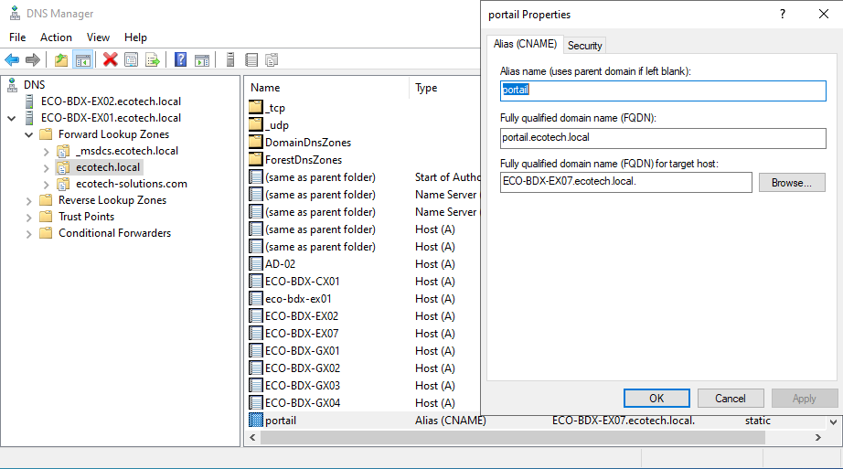
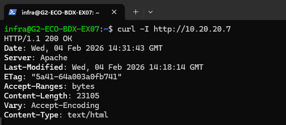
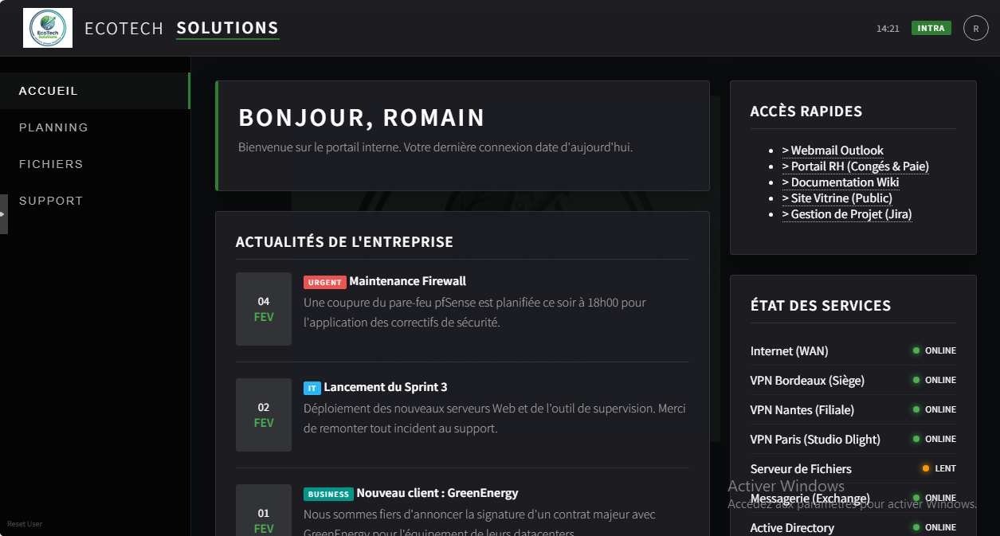

# Configuration du Serveur Web Intranet

## Table des matières :

- [1. Configuration Système et SSH](#1-configuration-système-et-ssh)
- [2. Hardening Apache (Sécurisation)](#2-hardening-apache-sécurisation)
- [3. Déploiement du Portail EcoTech](#3-déploiement-du-portail-ecotech)
- [4. Intégration DNS (Active Directory)](#4-intégration-dns-active-directory)
- [5. Tests de Validation](#5-tests-de-validation)

Ce document décrit la sécurisation du système, le durcissement d'Apache et l'intégration DNS.

## 1. Configuration Système et SSH

### Création d'un administrateur dédié

L'usage du compte `root` est proscrit pour l'exploitation courante.

* **Action** : Création de l'utilisateur `infra` avec privilèges `sudo`.

``` Bash
adduser infra
usermod -aG sudo infra
```

**Sécurisation SSH** : Pour prévenir les attaques par force brute, la connexion directe en root est bloquée.

- **Fichier** : `/etc/ssh/sshd_config`

**Modification** :

```
- Plaintext
- PermitRootLogin no
- Application : systemctl restart ssh
```

## 2. Hardening Apache (Sécurisation)

Par défaut, Apache diffuse sa version précise, ce qui est une vulnérabilité (Information Disclosure).

- **Fichier** : /etc/apache2/conf-available/security.conf

**Directives modifiées** :

```
ServerTokens Prod (N'affiche que "Apache" sans version).
ServerSignature Off (Masque la signature sur les pages d'erreur).
```

**Validation** : systemctl restart apache2


## 3. Déploiement du Portail EcoTech

La page par défaut a été remplacée par le site statique de l'entreprise.

- **Chemin** : /var/www/html/index.html
- **Contenu** : Page chartée EcoTech (Liens support, outils RH, actualités IT).
- **Permissions** : Fichiers attribués à l'utilisateur www-data.

## 4. Intégration DNS (Active Directory)

Pour simplifier l'accès utilisateur, des enregistrements ont été créés sur le contrôleur de domaine ECO-BDX-EX02.

- **Zone de recherche directe** : ecotech.local
- **Enregistrement A** : ECO-BDX-EX07 -> 10.20.20.7
- **Enregistrement CNAME (Alias)** : portail -> ECO-BDX-EX07.ecotech.local



## 5. Tests de Validation

### Test Sécurité :

- **Test Sécurité (Curl)** : curl -I http://10.20.20.7
- **Vérification** : Le header Server ne doit pas afficher de numéro de version (ex: 2.4.57).



### Test Accès :

- **Test Utilisateur** : Depuis un poste client, l'URL http://portail.ecotech.local doit afficher le site EcoTech.


