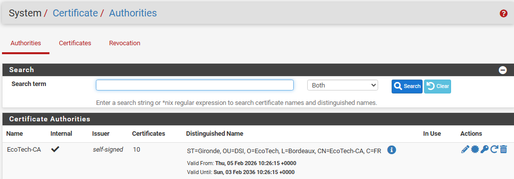
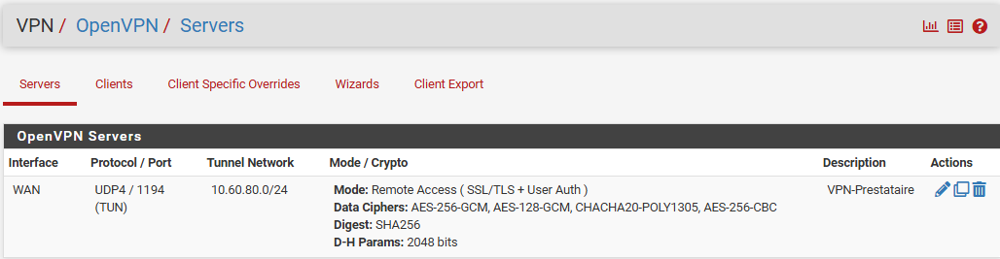
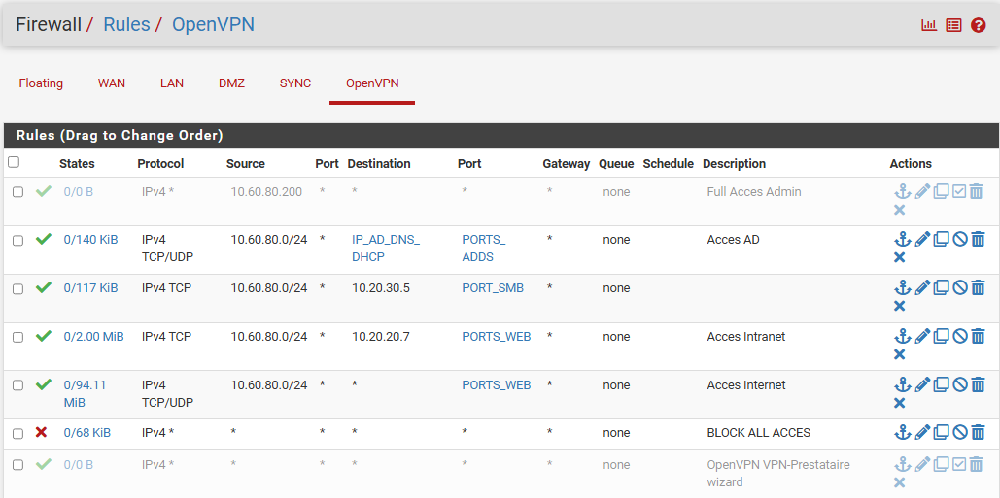

## Certificats et règles VPN

Sur cette pages se trouve la configuration des certificats pfSense pour la connexion VPN.
Cela comprends les certificat : *Racine, Serveur VPN, et Utilisateurs*, les règles de pare-feu, ainsi qu'un paragraphe sur les sauvegardes pfSense.

## Table des matières

- [Phase 1 : Cryptographie](#phase-1--cryptographie)
- [Phase 2 : Le Tunnel VPN](#phase-2--le-tunnel-vpn)
- [Phase 3 : Les utilisateurs](#phase-3--les-utilisateurs)
- [Phase 4 : Exportation de la Connexion](#phase-4--exportation-de-la-connexion)
- [Phase 5 : Le client distant](#phase-5--le-client-distant)
- [Phase 6 : Règles pour les prestataires](#phase-6--règles-pour-les-prestataires)
- [Phase 7 : Sauvegarde de la configuration pfSense](#phase-7--sauvegarde-de-la-configuration-pfsense)

#### Phase 1 : Cryptographie

*Etape 1 : Le certificat RACINE:*

  - Création de l'**autorité de certification** `EcoTech-CA` :
    - Sur **pfSense** :
    - System :
    - Certificate :
    - Authorities

  - Descriptions :
    - **Descriptive name :** `EcoTech-CA`
    - **Method :** `Create an internal Certificate Authority`
    - **Key length :** `2048` (Standard actuel)
    - **Digest Algorithm :** `SHA256`
    - **Country Code :** `FR`
    - **State/Province :** `Gironde`
    - **City :** `Bordeaux`
    - **Organization :** `EcoTech`
    - **Organizational Unit :** `DSI`

*Etape 2 : Le certificat VPN*

  - Création du **certificat** du serveur VPN :
    - Sur **pfSense** :
      - System :
        - Certificates :
          - Certificates

  - Descriptions :
    - **Method :** `Create an internal Certificate`
    - **Descriptive name :** `EcoTech-VPN-Server-Cert`
    - **Certificat Authority** : `EcoTech-CA`
    - **LifeTime** : `398`
    - **Key length :** `2048` (Standard actuel)
    - **Digest Algorithm :** `SHA256`
    - **Common Name** : `vpn.ecotech-solutions.fr`
    - **Certificat Type** : `Server Certificate` (Point essentiel de la configuration)

#### Phase 2 : Le Tunnel VPN

  - Configuration du services avec **Wizards** :
    - Sur **pfSense** :
      - VPN :
        - OpenVPN :
          - Wizards

  - **Configuration et Certificats** :
    - **Type of serveur** : `Local User Access` (mdp vérifié sur la base locale du pfSense)
    - **Certificat Authority** : `EcoTech-CA`
    - **Certificat** : `EcoTech-VPN-Server-Cert`

  - **Configuration du réseau** :

  - Descriptions :
    - **Description** : `VPN-Prestataire`
  - **Protocol** : `UDP on IPv4 only`
  - **Interface** : `WAN`
  - **Local Port** : `1194`
  - **IPv4 Tunnel Network** : `10.60.80.0/24` (SAS VPN)
  - **Redirect Local Network** : ✅ (Le trafic internet du prestataire est filtré par notre pare-feu)
  - **IPv4 Local Network** : `10.0.0.0/8`
  - **Concurrent Connections** : `10`
  - **Dynamic IP** : ✅
  - **Topology** : `Subnet`

- **Configuration du DNS** : 

  - Descriptions :
    - **DNS Default Serveur** : `ecotech.local`
    - **DNS Server 1** : `10.20.20.5` (AD principal)
    - **DNS Server 2** : `10.20.20.6` (AD secondaire)

- **Configuration du Pare-Feu** :

  - Descriptions :
    - **Firewal Rule** : ✅ (Permet la connexion à ce tunnel VPN)
    - **OpenVPN rule** : ✅ (Permet de se déplacer dans le réseau)

#### Phase 3 : Les utilisateurs

- Sur **pfSense** :
  - System :
    - User Manager :
    - Users

- **Ajout d'un Utilisateur** :

  - Descriptions :
    - **Username** : `zafernandez_ubihard`
    - **Password** : `Azerty1*`
    - **Full Name** : `Zara Fernandez UBIHard`
    - **Certificate** : ✅
    - **Descriptive Name** : `zara_fernandez_ubihard`
    - **Certificate Authority** : `EcoTech-CA`

- **Ajout d'un Utilisateur Test** :

  - Descriptions :
    - **Username** : `ecotech_test`
    - **Password** : `Azerty1*`
    - **Full Name** : `Test EcoTech`
    - **Certificate** : ✅
    - **Descriptive Name** : `ecotech_test`
    - **Certificate Authority** : `EcoTech-CA`

  - Sur **pfSense** :
    - VPN :
      - OpenVPN :
        - Client Specific Overrides

- **Orientation vers un IP précis** :

  - Descriptions:
    - **Descriptions** : `IP fixe Administrateur VPN`
    - **Common Name** : `ecotech_admin`
    - **IPv4 Tunnel Network** : `10.60.80.200/24`

#### Phase 4 : Exportation de la Connexion

**Mise à niveau de pfSense** :

- Avant d'effectuer l'export, vérifier que le **paquet additionnel** est bien installé.

  - Sur **pfSense** :
    - System :
      - Package Manager :
        - Available Packages
          - **Search term** : export
            - Téléchargement du paquet

  - Téléchargement des fichiers de **configuration VPN**

  - Sur **pfSense** :
    - VPN :
      - OpenVPN :
        - Client Export

- **Configuration du fichier à exporter** :

  - Descriptions :
    - **Host Name Resolution** : `Interface IP Address` (Avec la config 10.0.0.3)

#### Phase 5 : Le client distant

- Sur le **PC distant** le prestataire aura **OpenVPN** d'installer et configuré.
- Pour les tests la machine `Test-VPN` sera directement sur le réseau WAN avec l'adresse IP `10.0.0.4/29`

#### Phase 6 : Règles pour les prestataires  

- Règles pour le compte **Test** :

- Descriptions :
	- **Action** : `Pass`
	- **Protocol** : `Any`
	- **Source** : `Single Host or Alias` -> `10.60.80.200`
	- **Destination** : `Any`
	- **Description** : `FULL ACCESS ADMIN`

- Règles pour les **utilisateurs** en quatre temps :
  
- Descriptions règle 1 (Règle AD) :
	- **Action :** `Pass`        
	- **Protocol :** `TCP/UDP` (Important : les deux !)          
	- **Source :** `Network` -> `10.60.80.0` / `24`          
	- **Destination :** `Single Host or Alias` -> Allias `IP_AD_DNS_DHCP` comportant les IP `10.20.20.5 et 10.20.20.6`            
	- **Destination Port Range :** Allias `PORTS_ADDS` comportant les ports `88 Kerberos, 53 DNS, 636 LDAPs, 389 LDAP, 123 NTP`
	- **Description :** `Acces AD`

- Descriptions règle 2 (Règle serveur fichiers) :
	- **Action :** `Pass`        
	- **Protocol :** `TCP/UDP` (Important : les deux !)          
	- **Source :** `Network` -> tape `10.60.80.0` / `24`          
	- **Destination :** `Single Host or Alias` -> `10.20.30.5`            
	- **Destination Port Range :** Allias `PORTS_SMB` comportant le port `445 SMB`
	- **Description :** `Acces Files Server`

- Descriptions règle 3 (Serveurs WEB) :
	- **Action :** `Pass`        
	- **Protocol :** `TCP`            
	- **Source :** `Network` -> tape `10.60.80.0` / `24`          
	- **Destination :** `Single Host or Alias` -> tape `10.20.20.7`          
	- **Destination Port Range :** Allias `PORTS_WEB` comportant les ports `80 HTTP, 443 HHTPS, 53 DNS`
	- **Description :** `Acces Intranet WEB`  

- Descriptions règle 4 (Navigation Internet) :
	- **Action :** `Pass`        
	- **Protocol :** `TCP/UDP`            
	- **Source :** `Network` -> tape `10.60.80.0` / `24`          
	- **Destination :** `Any`        
	- **Destination Port Range :** Allias `PORTS_WEB` comportant les ports `80 HTTP, 443 HHTPS, 53 DNS`
	- **Description :** `Acces Internet`  

- Descriptions règle 5 (Blocage) :
	- **Action :** `Block`            
	- **Protocol :** `Any`            
	- **Source :** `Any`          
	- **Destination :** `Any`        
	- **Description :** `Bloque le reste`

### Phase 7 : Sauvegarde de la configuration pfSense

Avant toute intervention ou modification importante, il est fortement recommandé d'effectuer une sauvegarde de la configuration pfSense. Celle-ci se fait depuis l'interface web via Diagnostics > Backup & Restore. Il suffit de cliquer sur Download configuration as XML pour télécharger un fichier .xml contenant l'intégralité de la configuration (règles de pare-feu, certificats, paramètres OpenVPN, utilisateurs, etc.). En cas de problème, ce fichier permet de restaurer la configuration complète en quelques secondes via le même menu, avec le bouton Restore. Il est conseillé de stocker ce fichier dans un endroit sécurisé (gestionnaire de mots de passe type Bitwarden, ou partage réseau protégé) et d'en effectuer une nouvelle à chaque modification significative de la configuration.
